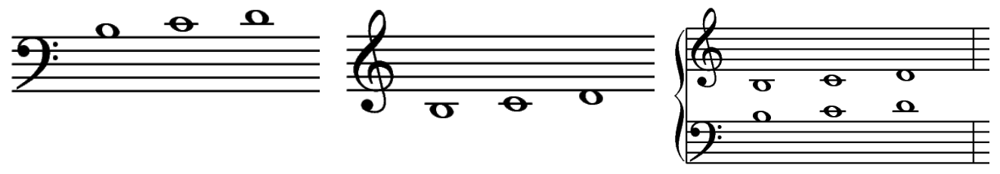

# Unit 1
[Contents](../README.md) [Next](../unit-02/unit-02.md)

## The Staff, Notes and Pitches

Music is written on a *staff* of five lines and the four spaces between.

Music *notes* are the symbols that are placed **on** the lines and **in** the spaces. They represent musical sounds called *pitches*.

The lines and spaces of the staff are numbered from bottom to top.

If the notes appear higher on the staff, they sound higher in pitch.
If the notes appear lower on the staff, they sound lower in pitch.

## Treble Clef and Staff

Music notes are named after the first seven letters of the alphabet, from A to G. By their position on the musical staff, they can represent the entire range of musical sound. *Clef* signs help to organize the staff so notes can easily be read. 

The *Treble clef* is used for notes in the higher pitch ranges. The treble (or G) clef has evolved from a stylized letter G into the symbol used today.

The curl of the treble clef circles the line on which the note G is placed. This G is above *middle C* (The C nearest the middle of the keyboard).

In the treble staff, the names of the notes on the lines from bottom to top are E, G, B, D, F.  
The most common way to remember this order is by the phrase "Every Good Boy Does Fine."

The names of the notes in the spaces from bottom to top spell FACE.

## Bass Clef and Staff

The *Bass clef* (pronounced "base") is used for notes in the lower pitch ranges. The bass (or F) clef has evolved from a stylized letter F into the symbol used today.

The two dots of the bass clef suround the line on which th note F is placed. This F is below middle C.

In the bass staff, the names of the notes on the lines from bottom to top are G, B, D, F, A.

The names of the notes in the spaces from bottom to top are A, C, E, G.

## The Grand Staff

When the bass and treble staff are connected by a brace and a line, they form the *Grand staff*.

## Ledger Lines - The Middle Notes

*Ledger lines* are short lines which are added to extend the range of the staff when the notes are too low or too high to be written on the staff.

The notes in the middle range of the grand staff are B, C, and D. They can be written on ledger lines in both the bass and treble staffs.

These notes are writen differently but sound the same.

## Ledger Lines - Low and High Notes

More than one ledger line may be added to extend the lower and upper ranges of the grand staff. The next higher notes the treble staff are G, A, B and C.

The next lower notes of the bass staff are F, E, D and C.

All the notes on the grand staff from bass clef Low C to treble clef High C:

