# Unit 2
[Contents](../README.md) [Previous](../unit-01/unit-01.md)

## Note Values

While the placement of notes on the staff indicates the pitch, the duration of the note (how long the note is held) is determined by the note value.

* A whole note is drawn as an open oval
* Two half notes equal the duration of one whole note.
* Four quarter notes equal the duration of two half notes.

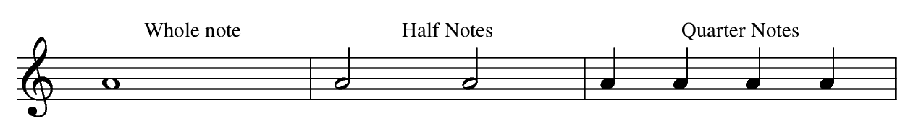

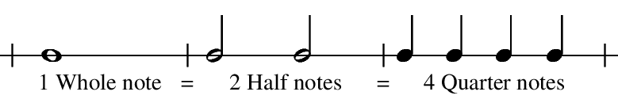

## Stems

Stems extend *downward on the left side* when the note appears **on or above** the 3rd line of the staff.

Stems extend *upward on the right side* when the note appears **below** the 3rd line on the staff.

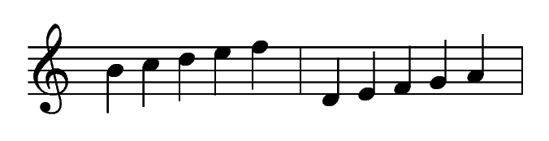

The stem length should continue to the space or line with the same letter or name, above or below.

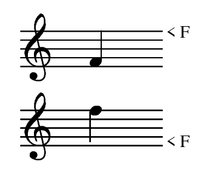

## Measure, Bar Line and Double Bar

Music is divided into equal parts by *bar lines.* The area between the two bar lines is called a *measure* or *bar.*

A *double bar* is written at the end of a piece of music. It is made up of one thin and on thick line, with the thick line always on the outside.

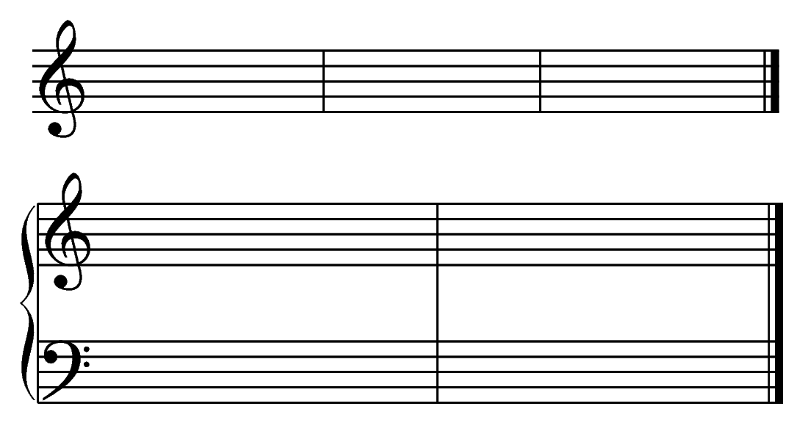

## Time Signature and Note Values

The *time signature* appears at the beginning of the music after the clef sign. It contains two numbers, one above the other.

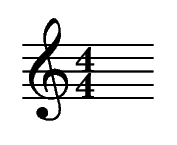

* The upper number tells how many beats (or counts) are in each measure. In this case, 4.
* The lower number indicates what type of note recieves one beat. In this case, a quarter note.

In 4/4 time:
* A quarter note is equal to one count. Count and clap the rhythm evenly once per beat. The beat numbers are written under the notes.  
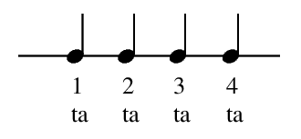
* A half note is equal to two counts. Count and clap the rhythm evenly.  
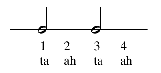
* A whole note is equal four counts/beats. Count and clap the rhythm evenly for 4 beats.  
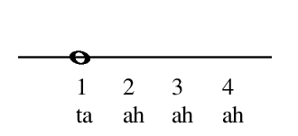

## Whole, Half and Quarter Rests

Music is not only made up of sounds, but also the silence between sounds. The duration of musical silenceis determined by the value of the *rest*.

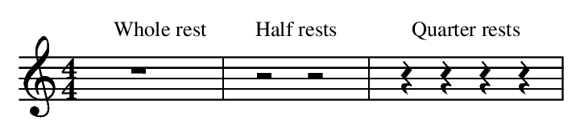

* A quarter rest is equal to one quarter of a whole rest.  
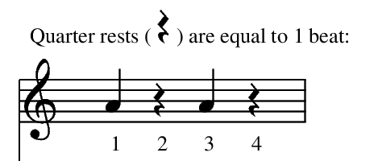
* A half rest is equal to half of a whole rest. It sits on the 3rd line.  
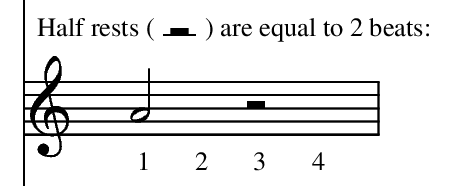
* A whole rest means to rest for a whole measure. It hangs down from the 4th line.  
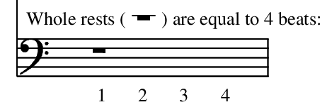

